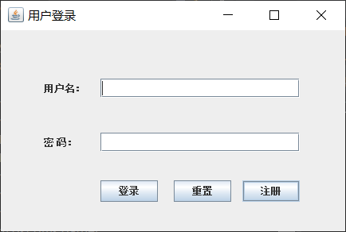
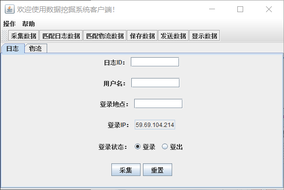
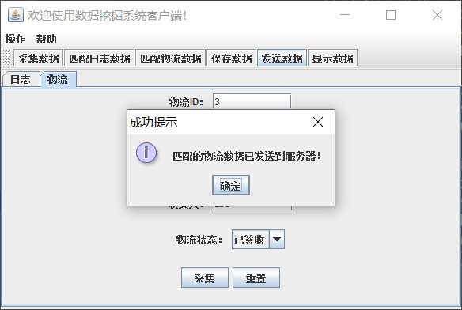
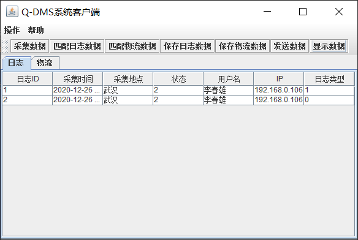
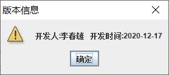
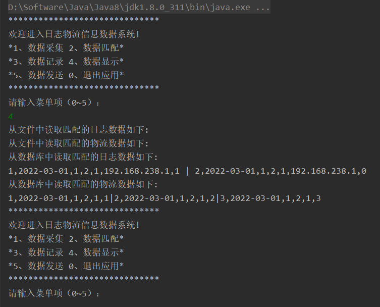

<p align="center">
    
    
    
    <a href="https://github.com/springbear2020/whut-billing-management-system" target="_blank">
        
    </a>
</p>

# 一、快速开始

1. 克隆仓库：使用 Git 克隆仓库或直接下载仓库压缩包到您的计算机来获取源代码。
2. 打开工程：使用 IntelliJ IDEA 开发工具打开克隆的仓库或解压的工程文件，而后使用 Maven 项目构建工具更新工程模块依赖。
3. 创建数据库并导入数据：登录 MySQL 控制台，创建一个名为 data_mining_system 的数据库，并将 document/sql/data_mining_system.sql 脚本中的建表语句和数据导入到 data_mining_system 数据库中。
4. 修改配置：修改 src/main/resources/mysql.properties 文件中的数据库连接信息，设置你自己的数据库用户名和密码。
5. 运行程序：运行 src/main/java/com/qst/dms/DmsNetServer.java 类。
6. 登录系统：系统的默认用户名和密码均为 admin。

# 二、系统简介

基于 Java Swing 的数据挖掘系统：采用客户端 / 服务器（C/S）架构设计，实现日志与物流数据的采集、匹配、保存和显示等功能，为数据分析挖掘提供基础支撑。


# 三、需求分析

1. C - S 模式：系统包括客户端和服务器端应用程序。

2. JDBC：用户和数据的数据库 CRUD 操作。

3. GUI 登录和注册界面设计与功能实现：用户能够进行注册和登录，授权后使用系统。

4. GUI 主界面设计与功能实现：能够实现日志和物流信息的数据采集、录登出对匹配、信息保存和数据显示等功能。

5. Socket 通信：客户端能够将数据发送到服务器端，服务器端接收客户端发送的日志和物流信息，而后进行保存和处理；服务端根据用户发出的请求，从数据库中查询对应信息并发返回给客户端。

6. 线程：系统能够进行数据自动刷新功能，与数据库保持同步。

# 四、任务分配

1. 基于控制台的系统数据采集、匹配、显示和记录功能实现：
      - 搭建数据挖掘系统框架。
      - 实现日志、物流数据的采集、匹配功能。
      - 实现匹配的日志、物流信息的文件保存和读取记录功能。
2. 基于 JDBC 的控制台系统基本功能实现：
      - 创建项目所需的数据库表，并搭建数据访问基础环境。
      - 实现并测试匹配的日志、物流信息的数据库保存和查询功能。
3. 基于 Swing GUI 的系统注册和登录界面设计实现：
      - 创建用户数据库表、用户实体类和用户业务逻辑类。
      - 创建用户注册窗口，并将用户注册信息保存到数据库。
      - 创建用户登录窗口，登录成功则进入系统主界面。
4. 基于 Swing GUI 系统主界面设计实现和系统优化：
      - 实现主界面中的菜单栏和选项卡栏。
      - 实现主界面中的日志、物流数据采集、匹配、保存和显示功能。
      - GUI 系统优化。
5. 系统客户端 - 服务器端数据发送（交互）功能实现：
      - 数据保存：客户端应用程序修改主界面发送数据页面响应，即使用 Socket 实现数据由客户端发送到服务器；服务器端应用程序使用 Server Socket 实现接收客户端发送的匹配日志和物流数据信息，并将信息保存到数据库。
      - 数据查询：客户端应用程序发出请求，服务端程序根据客户端发出的请求从数据库中查询出相应信息并返回给客户端，客户端根系服务端返回的信息处理后显示到界面。

# 五、功能要求

1. 用户登录和注册功能：用户验证口令通过后登录系统，新用户进行注册，并将注册信息保存数据库。

2. 日志、物流数据的采集功能：对日志和物流数据进行采集而后过滤匹配。

3. 日志、物流数据的筛选匹配功能，以日志信息为例：

      - 日志数据过滤匹配：根据日志的登录、登出状态，对日志进行分类，分别存放到登录、登出日志集合中。
      - 在登录日志和登出日志中，根据用户名和 IP 地址进行匹配：如果存在相同的用户名和 IP 地址，则日志信息匹配成功，将匹配的日志数据封装成匹配日志对象，并保存到匹配日志集合中。
      - 物流数据过滤匹配：根据物流的发货、送货、收货状态，对物流进行分类，分别存放到发货、送货、收货物流集合中。
      - 在发货记录、送货记录、收货记录中，根据收货进行匹配：如果存在相同的收货人，则物流信息匹配成功，将匹配的物流数据封装成匹配物流对象，并保存到匹配物流集合中。

4. 日志、物流数据的数据保存功能：在系统主界面中点击 “保存数据” 按钮时，将匹配的日志数据和物流数据保存到本地文件。

5. 客户端服务器端交互功能：

      - 客户端的数据发送功能：在客户端通过 Socket 技术向服务器端发送匹配的日志数据和物流数据；当数据发送成功后，清空客户端暂时存放数据的集合，弹出信息提醒；客户端收到相应数据后保存到数据库。

      - 服务器数据查询功能：当点击客户端显示数据功能时，服务器端从数据库中查找符合条件的数据，并发送到客户端；客户端将数据处理后以表格形式显示到主界面。

# 六、项目结构


```
DMS
├── document      -- 资源文档，如图片、SQL 脚本等
      ├── img           -- 项目图片
      ├── java          -- 资源代码
      ├── pdf           -- 指导文件
      ├── sql           -- 数据库脚本
├── src           -- 源代码  
      ├── db            -- 数据库操作类
            ├── DBUtil                    -- 数据库操作工具类
      ├── entity        -- 数据实体类
            ├── AppendObjectOutputStream  -- 解决 StreamCorruptedException 异常
            ├── Database                  -- 数据(日志、物流)基类
            ├── LogRec                    -- 日志信息类
            ├── MatchedLogRec             -- 匹配日志信息类
            ├── MatchedTransport          -- 匹配物流信息类
            ├── TableModel                -- 表格模型类
            ├── Transport                 -- 物流信息类
            ├── User                      -- 用户信息类
      ├── exception     -- 自定义异常类
            ├── DataAnalyseException      -- 自定义的异常处理类
      ├── gather        -- 数据过滤分析匹配类
            ├── DataFilter                -- 数据过滤抽象类
            ├── IDataAnalyse              -- 据分析（匹配）接口
            ├── LogRecAnalyse             -- 日志分析过滤类
            ├── TransportAnalyse          -- 物流分析过滤类
      ├── service       -- 日志、物流业务类
            ├── ExtraService              -- 额外服务类
            ├── LogRecService             -- 日志信息业务类
            ├── TransportService          -- 物流信息业务类
            ├── UserService               -- 用户信息业务类
      ├── ui            -- 用户界面
            ├── LoginFrame                -- 登录界面
            ├── MainFrame                 -- 系统主界面
            ├── RegisterFrame             -- 注册界面
      ├── util          -- 工具类
            ├── Config                    -- 文件加载配置类
      ├── DmsNetServer  -- GUI 程序和服务器启动类
      ├── MenuDriver    -- 控制台主程序
```

# 七、功能演示

## 7.1 用户注册


## 7.2 用户登录





## 7.3 主界面

   

## 7.4 数据发送保存

   

## 7.5 数据查询展示



## 7.6 版本信息



## 7.7 控制台程序




# 八、许可证

```
MIT License

Copyright (c) 2023 Spring-_-Bear

Permission is hereby granted, free of charge, to any person obtaining a copy
of this software and associated documentation files (the "Software"), to deal
in the Software without restriction, including without limitation the rights
to use, copy, modify, merge, publish, distribute, sublicense, and/or sell
copies of the Software, and to permit persons to whom the Software is
furnished to do so, subject to the following conditions:

The above copyright notice and this permission notice shall be included in all
copies or substantial portions of the Software.

THE SOFTWARE IS PROVIDED "AS IS", WITHOUT WARRANTY OF ANY KIND, EXPRESS OR
IMPLIED, INCLUDING BUT NOT LIMITED TO THE WARRANTIES OF MERCHANTABILITY,
FITNESS FOR A PARTICULAR PURPOSE AND NONINFRINGEMENT. IN NO EVENT SHALL THE
AUTHORS OR COPYRIGHT HOLDERS BE LIABLE FOR ANY CLAIM, DAMAGES OR OTHER
LIABILITY, WHETHER IN AN ACTION OF CONTRACT, TORT OR OTHERWISE, ARISING FROM,
OUT OF OR IN CONNECTION WITH THE SOFTWARE OR THE USE OR OTHER DEALINGS IN THE
SOFTWARE.
```

